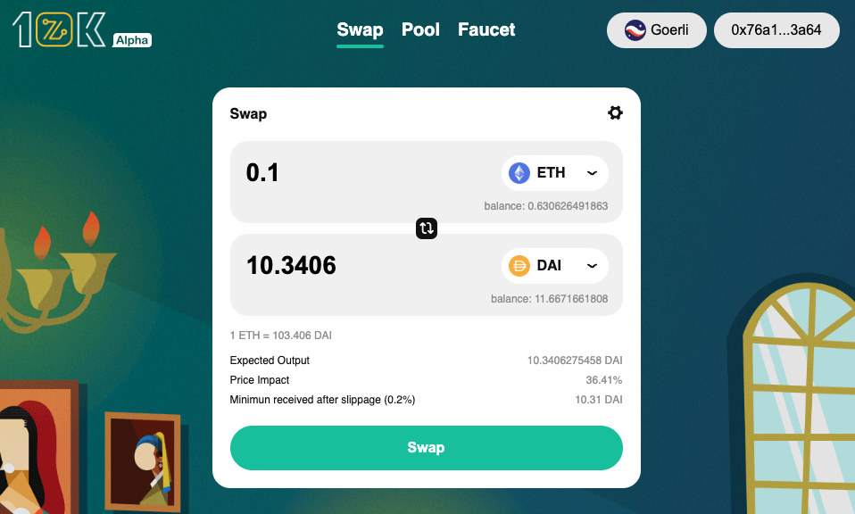

# 10Kswap Contracts for Cairo

**A decentralized ZK Rollup AMM** written in Cairo for [StarkNet](https://starkware.co/product/starknet/).
10Kswap is actively exploring the updated user experience of ZK technology application on AMM(Including but not limited to lower gas fees, higher TPS).
At the same time, Using the 10kswap decentralized AMM contract, token holder can freely create currency pairs without paying high fees.

## To preview 10Kswap

[`10kswap.com`](https://10kswap.com)



## Get started

#### Clone this repo

```
git clone git@github.com:0x60018/10k_swap-contracts.git
cd 10k_swap-contracts
```

#### Install dependencies

```
yarn install
```

#### Compile a contract

```
npx hardhat starknet-compile contracts/l0k_factory.cairo
```

#### Run a test that interacts with the compiled contract

```
npx hardhat test l0k_factory.test.ts
```

## Branches

- `main` Stable version
- `develop` New PRs and features

## Contracts

### l0k_factory

[`l0k_factory.cairo`](./contracts/l0k_factory.cairo)

- Mainnet Adddress: `-`
- Goerli Adddress: `0x06c31f39524388c982045988de3788530605ed08b10389def2e7b1dd09d19308`

#### Events

```cairo
func PairCreated(token0 : felt, token1 : felt, pair : felt, index : felt):
end
```

- `token0` is guaranteed to be strictly less than `token1` by sort order.
- `pair` token0 & token1 pair address
- `index` pair index, start from 0

#### constructor

```cairo
func constructor(pairClass : felt, feeToSetter : felt):
end
```

- `pairClass` l0k_pair contract class hash
- `feeToSetter` feeTo address manager

#### Read Functions

##### feeTo

```cairo
func feeTo() -> (feeTo : felt):
end
```

- `RETURNS`: feeTo

##### feeToSetter

```cairo
func feeToSetter() -> (feeToSetter : felt):
end
```

- `RETURNS`: feeToSetter

##### getPair

```cairo
func getPair(token0 : felt, token1 : felt) -> (pair : felt):
end
```

- `token0`: -
- `token1`: -
- `RETURNS`: pair

##### allPairs

```cairo
func allPairs(index : felt) -> (pair : felt):
end
```

- `index`: pair index
- `RETURNS`: pair

##### allPairsLength

```cairo
func allPairsLength() -> (length : felt):
end
```

- `RETURNS`: length

#### Write Functions

##### createPair

```cairo
func createPair(tokenA : felt, tokenB : felt) -> (pair : felt):
end
```

- `tokenA`: A token address
- `tokenB`: B token address
- `RETURNS`: pair
- `EVENTS`: PairCreated

##### setFeeTo

```cairo
func setFeeTo(feeTo : felt) -> ():
end
```

- `feeTo`: -

##### setFeeToSetter

```cairo
func setFeeToSetter(feeToSetter : felt) -> ():
end
```

- `feeToSetter`: -

### l0k_pair

[`l0k_pair.cairo`](./contracts/l0k_pair.cairo)

- ClassHash: `0x231adde42526bad434ca2eb983efdd64472638702f87f97e6e3c084f264e06f`

> ERC20 functions and events based on openzeppelin cairo, [click here](https://github.com/OpenZeppelin/cairo-contracts/blob/main/src/openzeppelin/token/erc20/library.cairo) for details.
> Thanks to [openzeppelin](https://github.com/OpenZeppelin/cairo-contracts) for powering cairo.

#### Events

##### Mint

```cairo
func Mint(sender : felt, amount0 : Uint256, amount1 : Uint256):
end
```

- `sender` Minter
- `amount0` Token0 amount
- `amount1` Token1 amount

##### Burn

```cairo
func Burn(sender : felt, amount0 : Uint256, amount1 : Uint256, to : felt):
end
```

- `sender` Burner
- `amount0` Token0 amount
- `amount1` Token1 amount
- `to` Recipient

##### Swap

```cairo
func Swap(
    sender : felt,
    amount0In : Uint256,
    amount1In : Uint256,
    amount0Out : Uint256,
    amount1Out : Uint256,
    to : felt,
):
end
```

- `sender` Swaper
- `amount0In` Token0 in amount
- `amount1In` Token1 in amount
- `amount0Out` Token0 out amount
- `amount1Out` Token1 out amount
- `to` Recipient

##### Sync

```cairo
func Sync(reserve0 : felt, reserve1 : felt):
end
```

- `reserve0` Token0 quantity in pair
- `reserve1` Token1 quantity in pair

#### Read Functions

##### MINIMUM_LIQUIDITY

```cairo
func MINIMUM_LIQUIDITY() -> (MINIMUM_LIQUIDITY : felt):
end
```

- `MINIMUM_LIQUIDITY` -

##### factory

```cairo
func factory() -> (factory : felt):
end
```

- `factory` l0k_factory contract

##### token0

```cairo
func token0() -> (token0 : felt):
end
```

- `token0` -

##### token1

```cairo
func token1() -> (token1 : felt):
end
```

- `token1` -

##### blockTimestampLast

```cairo
func blockTimestampLast() -> (blockTimestampLast : felt):
end
```

- `blockTimestampLast` -

##### price0CumulativeLast

```cairo
func price0CumulativeLast() -> (price0CumulativeLast : felt):
end
```

- `price0CumulativeLast` -

##### price1CumulativeLast

```cairo
func price1CumulativeLast() -> (price1CumulativeLast : felt):
end
```

- `price1CumulativeLast` -

##### kLast

```cairo
func kLast() -> (kLast : felt):
end
```

- `kLast` -

##### getReserves

```cairo
func getReserves() -> (reserve0 : felt, reserve1 : felt, blockTimestampLast : felt):
end
```

- `reserve0` Token0 quantity in pair
- `reserve1` reserve1 quantity in pair
- `blockTimestampLast` -

#### Write Functions

##### initialize

```cairo
func initialize() -> (token0 : felt, token1 : felt):
end
```

> called once by the factory at time of deployment

- `token0` -
- `token1` -

##### mint

```cairo
func mint(to : felt) -> (liquidity : Uint256):
end
```

- `to` Recipient
- `liquidity` Pair token quantity
- `EVENTS`

#### `external` burn

- Params:

| Name | Type | Desc |
| ---- | ---- | ---- |
| to   | felt | -    |

- Returns:

| Name    | Type    | Desc |
| ------- | ------- | ---- |
| amount0 | Uint256 | -    |
| amount1 | Uint256 | -    |

#### `external` swap

- Params:

| Name       | Type    | Desc |
| ---------- | ------- | ---- |
| amount0Out | Uint256 | -    |
| amount1Out | Uint256 | -    |
| to         | felt    | -    |

- Returns: -

#### `external` skim

- Params:

| Name | Type | Desc |
| ---- | ---- | ---- |
| to   | felt | -    |

- Returns: -

#### `external` sync

- Params: -

- Returns: -

#### `external` initialize

- Params:

| Name   | Type | Desc |
| ------ | ---- | ---- |
| token0 | felt | -    |
| token1 | felt | -    |

- Returns: -

### l0k_router

[`l0k_router.cairo`](./contracts/l0k_router.cairo)

- Mainnet Adddress: `-`
- Goerli Adddress: `0x00975910cd99bc56bd289eaaa5cee6cd557f0ddafdb2ce6ebea15b158eb2c664`

#### `view` factory

- Params: -

- Returns:

| Name    | Type | Desc |
| ------- | ---- | ---- |
| factory | felt | -    |

#### `view` quote

- Params:

| Name     | Type    | Desc |
| -------- | ------- | ---- |
| amountA  | Uint256 | -    |
| reserveA | felt    | -    |
| reserveB | felt    | -    |

- Returns:

| Name    | Type    | Desc |
| ------- | ------- | ---- |
| amountB | Uint256 | -    |

#### `view` getAmountOut

- Params:

| Name       | Type    | Desc |
| ---------- | ------- | ---- |
| amountIn   | Uint256 | -    |
| reserveIn  | felt    | -    |
| reserveOut | felt    | -    |

- Returns:

| Name      | Type    | Desc |
| --------- | ------- | ---- |
| amountOut | Uint256 | -    |

#### `view` getAmountIn

- Params:

| Name       | Type    | Desc |
| ---------- | ------- | ---- |
| amountOut  | Uint256 | -    |
| reserveIn  | felt    | -    |
| reserveOut | felt    | -    |

- Returns:

| Name     | Type    | Desc |
| -------- | ------- | ---- |
| amountIn | Uint256 | -    |

#### `view` getAmountsOut

- Params:

| Name     | Type    | Desc |
| -------- | ------- | ---- |
| amountIn | Uint256 | -    |
| path_len | felt    | -    |
| path     | felt\*  | -    |

- Returns:

| Name        | Type      | Desc |
| ----------- | --------- | ---- |
| amounts_len | felt      | -    |
| amounts_len | Uint256\* | -    |

#### `view` getAmountsIn

- Params:

| Name      | Type    | Desc |
| --------- | ------- | ---- |
| amountOut | Uint256 | -    |
| path_len  | felt    | -    |
| path      | felt\*  | -    |

- Returns:

| Name        | Type      | Desc |
| ----------- | --------- | ---- |
| amounts_len | felt      | -    |
| amounts_len | Uint256\* | -    |

#### `external` addLiquidity

- Params:

| Name           | Type    | Desc |
| -------------- | ------- | ---- |
| tokenA         | felt    | -    |
| tokenB         | felt    | -    |
| amountADesired | Uint256 | -    |
| amountBDesired | Uint256 | -    |
| amountAMin     | Uint256 | -    |
| amountBMin     | Uint256 | -    |
| to             | felt    | -    |
| deadline       | felt    | -    |

- Returns:

| Name      | Type    | Desc |
| --------- | ------- | ---- |
| amountA   | Uint256 | -    |
| amountB   | Uint256 | -    |
| liquidity | Uint256 | -    |

#### `external` removeLiquidity

- Params:

| Name       | Type    | Desc |
| ---------- | ------- | ---- |
| tokenA     | felt    | -    |
| tokenB     | felt    | -    |
| liquidity  | Uint256 | -    |
| amountAMin | Uint256 | -    |
| amountBMin | Uint256 | -    |
| to         | felt    | -    |
| deadline   | felt    | -    |

- Returns:

| Name    | Type    | Desc |
| ------- | ------- | ---- |
| amountA | Uint256 | -    |
| amountB | Uint256 | -    |

#### `external` swapExactTokensForTokens

- Params:

| Name         | Type    | Desc |
| ------------ | ------- | ---- |
| amountIn     | Uint256 | -    |
| amountOutMin | Uint256 | -    |
| path_len     | felt    | -    |
| path         | felt\*  | -    |
| to           | felt    | -    |
| deadline     | felt    | -    |

- Returns:

| Name        | Type      | Desc |
| ----------- | --------- | ---- |
| amounts_len | felt      | -    |
| amounts     | Uint256\* | -    |

#### `external` swapTokensForExactTokens

- Params:

| Name        | Type    | Desc |
| ----------- | ------- | ---- |
| amountOut   | Uint256 | -    |
| amountInMax | Uint256 | -    |
| path_len    | felt    | -    |
| path        | felt\*  | -    |
| to          | felt    | -    |
| deadline    | felt    | -    |

- Returns:

| Name        | Type      | Desc |
| ----------- | --------- | ---- |
| amounts_len | felt      | -    |
| amounts     | Uint256\* | -    |

#### `external` swapExactTokensForTokensSupportingFeeOnTransferTokens

- Params:

| Name         | Type    | Desc |
| ------------ | ------- | ---- |
| amountIn     | Uint256 | -    |
| amountOutMin | Uint256 | -    |
| path_len     | felt    | -    |
| path         | felt\*  | -    |
| to           | felt    | -    |
| deadline     | felt    | -    |

- Returns: -
